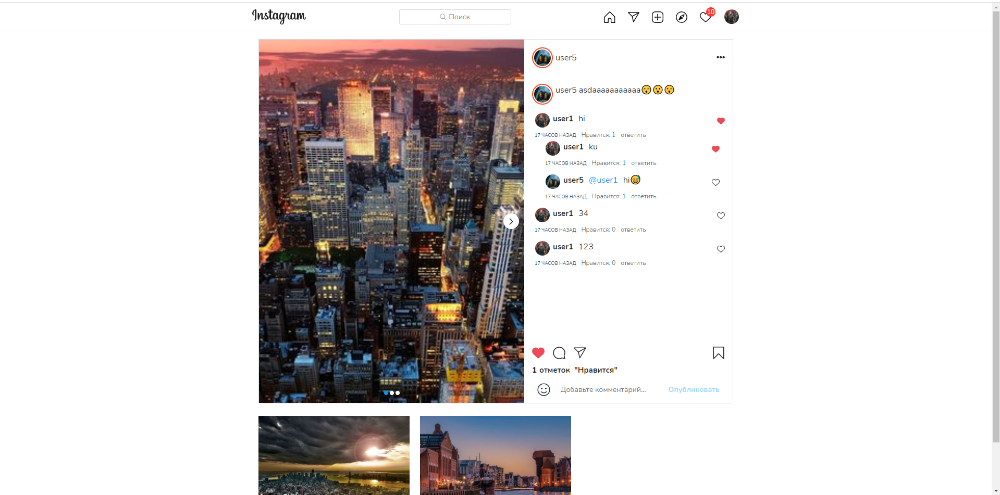

[Instagram](https://www.instagram.com/) клоне, MERN stack & Redux.

# Демо
[Deloy on Heroku](https://instclonee.herokuapp.com/)

# Проект разработан с использование 

#### Front-end

- React js
- React Router
- Redux (useSelector, useDispatch)
- Redux Thunk
- Axios
- moment
- Framer-motion

#### Back-end

- Node.js
- Express.js
- MongoDB
- Mongoose
- Cloudinary
- JSON Web Token
- Bcrypt.js
- Dotenv

# Функции

- Аутентификация (авторизация/регистрация)
- Добавление постов
- Удаление постов
- Лайкать посты
- Просмотр каждого поста
- Комментирование постов
- Отвечать на комментарии
- Лайкать комментарии
- Поиск пользователей
- Профиль каждого пользователя
- Подписываться или отписываться

# Скриншоты

### Главная

### Добавление поста (шаг 1)

### Добавление поста (шаг 2)

### Добавление поста (шаг 3)

### Отдельный пост

### Посты всех пользователей, которые не подписаны

### Добавление пользователя для общение

### Страница переписки

### Уведомления

### Поиск пользователя

### Профиль пользователя

### Редактирование профиля

### Список подписчиков

### Список подписков

# Client:

`$ cd client` 
`$ npm install` 
`$ npm start` 

# Server:

`$ npm install` 
`$ npm run server` 